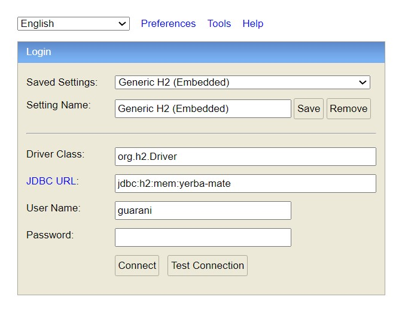
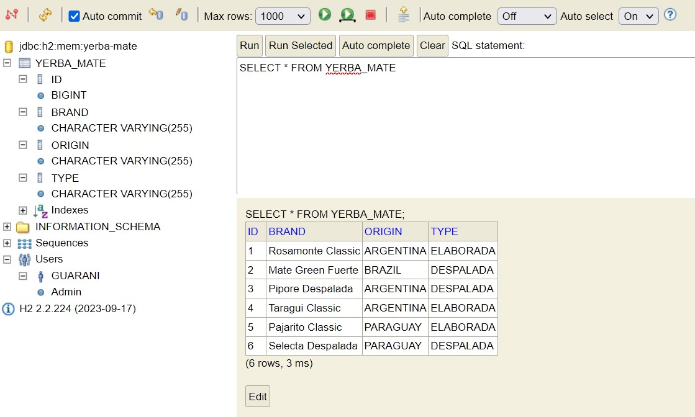

## SOAP Web Service Example

## Table Of Content

- [Project Details](#project-details)
- [Project Components](#project-components)
  + [Components Description](#components-description)
  + [Schema Definition](#schema-definition)
- [Request Example](#request-example)
- [Response Example](#response-example)
- [Screenshots](#screenshots)
- [Dependencies](#dependencies)

## Project Details

- Language: `Java 17 (LTS)`
- Built with: `Maven`, `Spring Boot`
- In-Memory Database: `H2`
- Configuration file: [application.properties](./src/main/resources/application.properties)
- Endpoint: [http://localhost:8080/soap-demo](http://localhost:8080/soap-demo)

<div align='right'>
    <a href="#table-of-content">Back To The Table Of Content</a>
</div>

## Project Components

- [com.example.soap.example](./src/main/java/com/example/soap/example)
  + class [SoapExampleApplication](./src/main/java/com/example/soap/example/SoapExampleApplication.java)

  + [annotation](./src/main/java/com/example/soap/example/annotation)
    * @interface [YerbaMateExample](./src/main/java/com/example/soap/example/annotation/YerbaMateExample.java)  
  
  + [config](./src/main/java/com/example/soap/example/config)
    * class [MappingConfig](./src/main/java/com/example/soap/example/config/MappingConfig.java)
    * class [WebServiceConfig](./src/main/java/com/example/soap/example/config/WebServiceConfig.java)
  
  + [endpoint](./src/main/java/com/example/soap/example/endpoint)
    * class [YerbaMateEndpoint](./src/main/java/com/example/soap/example/endpoint/YerbaMateEndpoint.java)

  + [entity](./src/main/java/com/example/soap/example/entity)
    * class [YerbaMateEntity](./src/main/java/com/example/soap/example/entity/YerbaMateEntity.java)

  + [persistence](./src/main/java/com/example/soap/example/persistence)
    * interface [YerbaMateRepository](./src/main/java/com/example/soap/example/persistence/YerbaMateRepository.java)

  + [schema](./src/main/java/com/example/soap/example/schema)
    * enum [Country](./src/main/java/com/example/soap/example/schema/Country.java)
    * class [GetYerbaMateRequest](./src/main/java/com/example/soap/example/schema/GetYerbaMateRequest.java)
    * class [GetYerbaMateResponse](./src/main/java/com/example/soap/example/schema/GetYerbaMateResponse.java)
    * class [ObjectFactory](./src/main/java/com/example/soap/example/schema/ObjectFactory.java)
    * [package-info](./src/main/java/com/example/soap/example/schema/package-info.java)
    * class [YerbaMate](./src/main/java/com/example/soap/example/schema/YerbaMate.java)
    * enum [YerbaMateType](./src/main/java/com/example/soap/example/schema/YerbaMateType.java)

  + [service](./src/main/java/com/example/soap/example/service)
    * interface [YerbaMateService](./src/main/java/com/example/soap/example/service/YerbaMateService.java)
    * class [YerbaMateServiceImpl](./src/main/java/com/example/soap/example/service/YerbaMateServiceImpl.java)

  + [utils](./src/main/java/com/example/soap/example/utils)
    * class [YerbaMateConverter](./src/main/java/com/example/soap/example/utils/YerbaMateConverter.java)
    * class [YerbaMateExampleProcessor](./src/main/java/com/example/soap/example/utils/YerbaMateExampleProcessor.java)
    * class [YerbaMateFactory](./src/main/java/com/example/soap/example/utils/YerbaMateFactory.java)

<div align='right'>
    <a href="#table-of-content">Back To The Table Of Content</a>
</div>

### Components Description

1. Annotation

   + **YerbaMateExample** - Custom annotation to annotate method that returns instance of **YerbaMate**.


2. Configuration layer

   + **MappingConfig** - Bean declaration of **ModelMapper**.

   + **WebServiceConfig** - Configuration of Web Service.


3. Endpoint 

   + **YerbaMateEndpoint** - Web Service Endpoint declaration.


4. Entity

   + **YerbaMateEntity** - Entity representation of **YerbaMate**.


5. Repository layer

   + **YerbaMateRepository** - JPA Repository of **YerbaMateEntity**.


6. Schema

   + **Country** - Enum of countries of origins of Yerba maté.
   + **GetYerbaMateRequest** - Anonymous complex type definition.
   + **GetYerbaMateResponse** - Anonymous complex type definition.
   + **ObjectFactory** - Produces instances of Java representation of XML content.
   + **YerbaMate** - DTO representation of Yerba maté.
   + **YerbaMateType** - Enum of produced types of Yerba maté.


7. Service layer

   + **YerbaMateService** - **YerbaMate** Service definition.
   + **YerbaMateServiceImpl** - **YerbaMate** Service implementation - business logic.


8. Utils

   + **YerbaMateConvert** - Map DTOs and entities to each other using **ModelMapper**.
   + **YerbaMateExampleProcessor** - Process usage of **YerbaMateExample** annotation with `Java Reflections`.
   + **YerbaMateFactory** - Produces prebuilt instances of **YerbaMate**.

<div align='right'>
    <a href="#table-of-content">Back To The Table Of Content</a>
</div>

## Schema Definition

File [yerba-mate.xsd](./src/main/resources/yerba-mate.xsd):

```xml
    <xs:schema xmlns:xs="http://www.w3.org/2001/XMLSchema"
               xmlns:tns="http://localhost:8080/soap-demo"
               targetNamespace="http://localhost:8080/soap-demo"
               elementFormDefault="qualified">
    
        <xs:element name="getYerbaMateRequest">
            <xs:complexType>
                <xs:sequence>
                    <xs:element name="brand" type="xs:string"/>
                </xs:sequence>
            </xs:complexType>
        </xs:element>
    
        <xs:element name="getYerbaMateResponse">
            <xs:complexType>
                <xs:sequence>
                    <xs:element name="yerbaMate" type="tns:yerbaMate"/>
                </xs:sequence>
            </xs:complexType>
        </xs:element>
    
        <!-- PAYLOAD -->
        <xs:complexType name="yerbaMate">
            <xs:sequence>
                <xs:element name="brand" type="xs:string"/>
                <xs:element name="origin" type="tns:country"/>
                <xs:element name="type" type="tns:yerbaMateType"/>
            </xs:sequence>
        </xs:complexType>
    
        <xs:simpleType name="country">
            <xs:restriction base="xs:string">
                <xs:enumeration value="Argentina"/>
                <xs:enumeration value="Brazil"/>
                <xs:enumeration value="Paraguay"/>
            </xs:restriction>
        </xs:simpleType>
    
        <xs:simpleType name="yerbaMateType">
            <xs:restriction base="xs:string">
                <xs:enumeration value="elaborada"/>
                <xs:enumeration value="despalada"/>
            </xs:restriction>
        </xs:simpleType>
    </xs:schema>
```

<div align='right'>
    <a href="#table-of-content">Back To The Table Of Content</a>
</div>

## Request Example

File [request-example.xml](./src/main/resources/request-example.xml "Request example"):

```xml
    <soapenv:Envelope xmlns:soapenv="http://schemas.xmlsoap.org/soap/envelope/"
                      xmlns:std="http://localhost:8080/soap-demo">
    
        <soapenv:Header/>
        <soapenv:Body>
            <std:getYerbaMateRequest>
                <std:brand>Pajarito Classic</std:brand>
            </std:getYerbaMateRequest>
        </soapenv:Body>
    
    </soapenv:Envelope>
```

Send request using `curl`:

```shell
    curl --location 'http://localhost:8080/soap-demo' --header 'Content-Type: text/xml' --data @./src/main/resources/request-example.xml
```

<div align='right'>
    <a href="#table-of-content">Back To The Table Of Content</a>
</div>

## Response Example

```xml
    <SOAP-ENV:Envelope xmlns:SOAP-ENV="http://schemas.xmlsoap.org/soap/envelope/">
        <SOAP-ENV:Header/>
        <SOAP-ENV:Body>
            <ns2:getYerbaMateResponse xmlns:ns2="http://localhost:8080/soap-demo">
                <ns2:yerbaMate>
                    <ns2:brand>Pajarito Classic</ns2:brand>
                    <ns2:origin>Paraguay</ns2:origin>
                    <ns2:type>elaborada</ns2:type>
                </ns2:yerbaMate>
            </ns2:getYerbaMateResponse>
        </SOAP-ENV:Body>
    </SOAP-ENV:Envelope>
```

<div align='right'>
    <a href="#table-of-content">Back To The Table Of Content</a>
</div>

## Screenshots





<div align='right'>
    <a href="#table-of-content">Back To The Table Of Content</a>
</div>

## Dependencies

|            ArtifactId            | Version |
|:--------------------------------:|:-------:|
|       Spring Boot Starter        |  3.2.0  |
|   Spring Boot Starter Data JPA   |  3.2.0  |
| Spring Boot Starter Web Services |  3.2.0  |
|              WSDL4J              |  1.6.3  |
|             Jaxb-API             |  2.3.1  |
|                H2                | 2.2.224 |
|           ModelMapper            |  3.2.0  |
|              Lombok              | 1.18.30 |

<div align='right'>
    <a href="#table-of-content">Back To The Table Of Content</a>
</div>

## Author

[@lucasmalara](https://github.com/lucasmalara "author")
